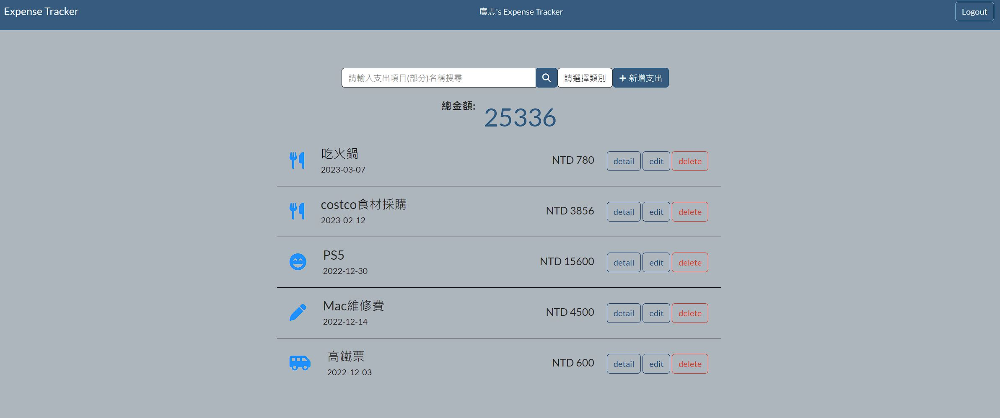

# Expense Tracker



## APP介紹
可用作紀錄日常開銷的APP

## 功能
1. 可瀏覽、新增、修改、刪除各項花費
2. 可依照分類瀏覽花費
3. 可搜尋項目名稱以即分類名稱
4. 可使用facebook帳號註冊即登入

## APP操作流程
## 開始使用

1. 請確認已安裝 node.js 與 npm (使用版本請見文件最下方)
2. 下載或 clone 此專案至本地資料夾

   ```bash
   git clone https://github.com/dinsky21/expense-tracker.git
   ```

3. 在資料夾建立.env 檔案，並將以下 code 複製進入此檔案，並注意須將中文區域更改為個人的 mongoDB 資訊

```bash
MONGODB_URL =
  "mongodb+srv://(mongodb 帳號):(密碼)@cluster0.w9mfqtb.mongodb.net/(MongoDB資料庫名稱)?retryWrites=true&w=majority"
```

4. 請先執行以下指令，建立種子資料

```bash
npm run seed
```

5. 若要啟網站，使用 terminal 於該資料夾內執行

   ```bash
   npm run dev
   ```

6. 若看見下方訊息則代表網站順利運行，打開瀏覽器輸入網址 localhost:3000 可開始使用

   ```bash
   The express is running on localhost:3000
   ```
7. 可使用以下種子資料登入檢視各項功能是否正常
		email: 'root@example.com', password: 'root1234'

8. 若需結束 local hosting，請於 terminal 內按下 ctrl + c 即可

## 開發工具

- node.js 16.17.0
- nodemon 2.0.20
- Express 4.18.2
- Express-Handlebars 3.0.0
- Bootstrap 5.1.3
- Font Awesome 5.8.1
- mongoose 6.7.0
- dotenv 16.0.3
- method-override 3.0.0
- bcryptjs 2.4.3
- connect-flash 0.1.1
- expression-session 1.17.3
- passport 0.6.0
- passport-facebook 3.0.0
- passport-local 1.0.0
- handlebars: 4.7.7
- just-handlebar-helpers:1.0.19